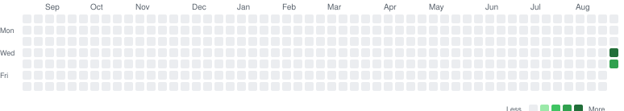

# Junior CV / Perception Engineer

Camera + IMU (sensor fusion) · C++ · Deep Learning

42-week practice track (~10–11 months). Weekdays 1–2 hours. Saturday off. Sunday = review + small upgrade.

<!-- STREAK:START -->


**Streak 2** · longest 2 · active days **2** · Saturday rest does not break the streak

Log a day: `python tools/streak.py log --hours 1.5 --note "what I did"`
<!-- STREAK:END -->

This repo is the portfolio. Every week ends with code, plots, and a note in `PROGRESS.md`.

Another Cursor account: read [`AGENTS.md`](AGENTS.md) first. Project rules live in [`.cursor/rules/`](.cursor/rules/).

## How a week works

1. Open `weeks/week-XX-*/README.md` — that is the only plan for the week.
2. Work Mon–Fri, max 2 hours. Stop when the timer ends; finish on Sunday if needed.
3. Sunday: rewrite 5 facts in a notebook, do the small upgrade, tick `PROGRESS.md`, commit, push.
4. Log the day so the heatmap updates:

```powershell
python tools/streak.py log --hours 1.5 --note "01_arrays passed"
```

5. Message the mentor: «Неделя N готова» + what worked / what blocked you.

## Setup (Windows)

```powershell
python -m venv .venv
.\.venv\Scripts\Activate.ps1
pip install -r requirements.txt
```

If activation is blocked:

```powershell
Set-ExecutionPolicy -Scope CurrentUser RemoteSigned
```

C++ toolchain (weeks 13+): CMake + a compiler. We will set it up when that phase starts — not now.

## Roadmap (~11 months)

Python first so the idea lands. Then the same piece in C++. Deep Learning after classical features — otherwise SuperPoint is magic.

| Phase | Weeks | What you can do at the end |
|---|---|---|
| 1 Foundation | 1–4 | NumPy without fear; rotate vectors; integrate IMU and see drift |
| 2 Camera | 5–8 | OpenCV, pinhole model, calibrate a camera, match features |
| 3 Visual Odometry | 9–12 | Epipolar geometry, PnP, a VO pipeline with ATE/RPE |
| 4 C++ | 13–20 | CMake, C++17, Eigen, OpenCV C++, a small filter/VO binary |
| 5 Sensor Fusion | 21–24 | Attitude filters, EKF, camera–IMU frames |
| 6 Deep Learning | 25–34 | Train a CNN, transfer, YOLO, segmentation, SuperPoint + LightGlue |
| 7 VIO | 35–38 | Toy VIO + EuRoC load/sync/eval |
| 8 Job-ready | 39–42 | ROS2 C++ node, capstone, interview sheet |

Out of scope on purpose: template metaprogramming, Boost, GANs, LLMs, diffusion, writing VINS-Mono from scratch.

### Week titles

1. NumPy: IMU as arrays
2. Rotations SO(3)
3. Quaternions and frames
4. IMU dead reckoning
5. Images and OpenCV
6. Pinhole camera
7. Camera calibration
8. Features and matching
9. Epipolar geometry
10. PnP and triangulation
11. Optical flow → VO
12. VO pipeline + metrics
13. CMake and C++17 start
14. RAII, classes, headers
15. Eigen: matrices and SO(3)
16. Eigen: quaternions and frames
17. OpenCV C++ images
18. OpenCV C++ camera
19. IMU parser + complementary filter (C++)
20. C++ mini-project
21. IMU model for VIO
22. Attitude filters
23. EKF 3D
24. Camera–IMU extrinsics
25. PyTorch tensors
26. Autograd and training loop
27. MLP and overfitting
28. CNN internals
29. Train a CNN (CIFAR / Fashion-MNIST)
30. Transfer learning
31. Object detection (YOLO)
32. Segmentation
33. SuperPoint vs ORB
34. LightGlue front-end
35. VIO architecture
36. Toy VIO
37. EuRoC loader
38. VIO evaluation
39. ROS2 C++ camera+IMU node
40. Capstone part 1
41. Capstone part 2
42. Portfolio and interview

## Repo layout

```
weeks/week-01-numpy-imu/   ← you are here
PROGRESS.md                ← tick this every Sunday
activity.json              ← days for the heatmap
AGENTS.md                  ← handoff for the other Cursor account
tools/streak.py            ← log a day, redraw squares
```

Later weeks get their own folder in `weeks/`. Do not rewrite old weeks unless Sunday's upgrade says so.

## Current week

Start here: [weeks/week-01-numpy-imu/README.md](weeks/week-01-numpy-imu/README.md)
